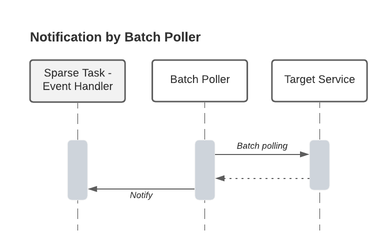
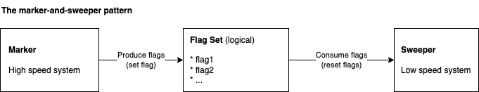

# Parallel Processing Patterns (PP-Patterns)

**Table of contents**

- [Parallel Processing Patterns (PP-Patterns)](#parallel-processing-patterns-pp-patterns)
  - [Introduction](#introduction)
  - [Consideration of Parallelism and Synchronization](#consideration-of-parallelism-and-synchronization)
    - [Computer System Fundamentally Supports Parallel Processing](#computer-system-fundamentally-supports-parallel-processing)
    - [Sequential Programming Is The Origin](#sequential-programming-is-the-origin)
    - [Parallelism And Asynchronous Model Are Needed](#parallelism-and-asynchronous-model-are-needed)
    - [Programming Model Evolved](#programming-model-evolved)
  - [Parallel Processing Principles](#parallel-processing-principles)
    - [1. Isolation At The Top](#1-isolation-at-the-top)
    - [2. Favor Batch Operations](#2-favor-batch-operations)
    - [3. Subsystem Decoupling Over Operation Cascading](#3-subsystem-decoupling-over-operation-cascading)
    - [4. Plan System Limit](#4-plan-system-limit)
  - [PP-Patterns](#pp-patterns)
    - [1. Batch Stage Chain](#1-batch-stage-chain)
      - [Problem](#problem)
      - [Solution](#solution)
      - [Consequences](#consequences)
    - [2. Request Aggregator](#2-request-aggregator)
      - [Problem](#problem-1)
      - [Solution](#solution-1)
      - [Consequences](#consequences-1)
    - [3. Rolling Poller Window](#3-rolling-poller-window)
      - [Problem](#problem-2)
      - [Solution](#solution-2)
      - [Consequences](#consequences-2)
    - [4. Sparse Task](#4-sparse-task)
      - [Problem](#problem-3)
      - [Solution](#solution-3)
      - [Consequences](#consequences-3)
    - [5. Marker and Sweeper](#5-marker-and-sweeper)
      - [Problem](#problem-4)
      - [Solution](#solution-4)
      - [Consequences](#consequences-4)
      - [Examples](#examples)
  - [Epilogue](#epilogue)

## Introduction
While developing services, with scalability, throughput, and performance as significant concerns,
some common problems in parallel processing emerge. The solution for
each situation is shareable, so I'm summarizing them as patterns. The target problems are mostly concurrent operations, parallel processing, throttle control, and I/O-sensitive operations.

These patterns are less common than the GoF Design Patterns but are practical in specific scenarios.
Awareness of these patterns at an early design and implementation phase will
benefit performance-critical services.

_These patterns are gathered from development practice and named early. Others may have already identified some of them with different names. If there's an existing reference, please create an issue or PR in this repo._

Source: [https://github.com/nanw1103/parallel-processing-patterns/blob/main/README.md](https://github.com/nanw1103/parallel-processing-patterns/blob/main/README.md)

## Consideration of Parallelism and Synchronization

### Computer System Fundamentally Supports Parallel Processing
The modern computer system typically adopts the interrupt mechanism for I/O. Upon signal, it triggers the
CPU to suspend the current path and execute a different one. Though the per-CPU execution is
still sequential at the micro-level, the execution model exposed is logically parallel. Considering multiple
CPUs and cores, a computer system fundamentally supports parallel execution and is suitable for the
asynchronous model.

However, such an asynchronous model is not intuitive to the human mind, which is more
comfortable with _sequential operations_. It also needs to be more intuitive to write synchronous routines down.

### Sequential Programming Is The Origin
One could debate whether programming is for the computer to execute or for humans to write and read.
If we look back upon the evolution of programming languages, we can see that in the last 60 years,
programming languages are evolving from computer-friendly (punched card) to human-friendly (assembly,
C++, Python). The programming languages aim to optimize for humans: make reading and writing easier. The compiler handles the computer-oriented optimization, the programming model by each language, and OS
stacks.

So human-friendly is a key for programming languages, and sequential operation is easy to understand and write down.
Today's most high-level programming languages are _concurrent programming languages_
that have the sequential model as native support.  

The following is an example of sequential operations:

    First, make a phone call to R2D2.

    Ask R2D2 to translate an article (which takes some time) and await a response.
 
    Print the translation

    Make a phone call to 3-PO.

    Ask 3-PO to translate an article (which takes some time) and await a response.

    Print the translation

The example is easy to write and understand because the human mind suits this style. The
tasks (translation process) run on separate systems (the robots) and are logically parallel to the
run of the main logic above. However, we model the process in many cases, as shown above, because
it has an undeniable advantage: it is easy to create and read for humans. The critical point in achieving this
is that the parallel execution is converted to a blocking operation: "ask and wait." This style is commonly
adopted, at the OS level, in libraries, and at application layers. And this blocking style is typically
supported natively by many programming languages, C, Java, Python, etc.

### Parallelism And Asynchronous Model Are Needed

The cost of sequential operation is obvious: we need to utilize the parallelism and asynchronous capability provided by the
system, and the execution takes longer. So it comes to multiple technologies for this:

* Thread: OS-level thread and the programming language side counterpart. Threading retains the
sequential logic style nicely while supporting parallel operations.
* Callback: describe what to do upon an event. Programming language runtime handles the parallel execution and hides details from the developer.
 

Example of parallel execution using threads

    Define thread 1:
 
        Make a phone call to R2D2.

        Ask R2D2 to translate an article (which takes some time) and await a response.

        Print the translation
   
    Define thread 2:

        Make a phone call to 3-PO.

        Ask 3-PO to translate an article (which takes some time) and await a response.

        Print the translation
   
    Run thread 1 and thread 2 in parallel.

Example of parallel execution using callbacks

    Make a phone call to R2D2.

    Ask R2D2 to translate an article (non-blocking), upon on response do:
   
        Print the translation
   
    Make a phone call to 3-PO.

    Ask 3-PO to translate an article (non-blocking), upon on response do:

        Print the translation

### Programming Model Evolved

One interesting observation is about the asynchronous patterns as first-class support in programming languages. However, before talking about that, let's look back upon the sequential programming model:
threading.

The threading model has its advantages derived from OS native implementation. It helps to describe the steps to complete a task sequentially. That is due to the synchronous nature: synchronous operations are easier to describe and understand. But the sequential model is hard to optimize when asynchronous is the central theme. The model provided by programming languages causes such difficulties. Is there a different model that can describe asynchronous problems easier? Then genius invented asynchronous-native languages, like JavaScript, which do everything asynchronously by default. The runtime handles the asynchronous operation to lower-level calls (OS, I/O), hiding the complexity from programmers. As a result, such languages are fluent in describing asynchronous tasks.

Examples of sequential-native languages are C++, Java, and Python. By their nature, it's easy to describe sequential problems.
Examples of asynchronous-native languages are the JavaScript family (CoffeeScript, TypeScript). By their nature, it's easy to describe a parallel routine.

The exciting thing is that none of these two styles dominates. Later, sequential-native languages added features to support describing asynchronously by introducing concepts like Future in Java and C++, _async_ and _await_ in C#, Rx framework, etc. These are easy to achieve in asynchronous-native languages like JavaScript. While JavaScript also introduced _await_ later to improve the capability to describe sequential operations.

There are other models and concepts which fundamentally simplify how parallelism problems are described, or concurrency is achieved. For example, Java Executor, Java Parallel Streaming, Erlang messaging, Golang channel, Golang goroutine. Developers see fewer unnecessary details, and the models and concepts are better in abstraction for describing common problems.

No matter how the building block evolves, one of the core problems to solve for I/O-centric and performance-sensitive service remains unchanged: to identify the cross-boundary heavyweight operations, utilize the
building blocks to optimize these operations via parallelism or batch, reduce the number of calls, to achieve shorter execution time, higher throughput, and lower system cost.
 
## Parallel Processing Principles

An engineer designs according to experience, and an architect designs according to methodologies.

### 1. Isolation At The Top
Identify unrelated operations at the highest level, and isolate and process them in parallel. Isolation at the highest level solves the core problem in parallel processing and avoids contention. If a design is architecturally sequential, there will be little margin to enhance at the micro-level.

### 2. Favor Batch Operations
Software engineering is similar to making a castle with building blocks. The feature of your building blocks impacts how you build a castle. Therefore, understanding the building blocks and choosing the proper ones will be beneficial. In most cases, as building blocks provided by the layers you depend on, batch operations are designed for optimization and will outperform single-resource operations if appropriately used.

### 3. Subsystem Decoupling Over Operation Cascading
Operation cascading is a pattern that a downstream operation is triggered directly upon the upstream operation. There are many forms of how it exists. For example, on condition A, do operation B, and inside operation B, do operation C. Operation C is a cascaded operation from operation B. Operation cascading has advantages and suitable scenarios due to its simplicity and intuition. In a complex system, especially subsystems with different processing paces, consider decoupling major subsystems using producer-consumer or mark-and-sweep.

### 4. Plan System Limit
Every system within its lifecycle has a scalability limit. Identifying the limit at the design phase will clear your way to build the system.

## PP-Patterns

### 1. Batch Stage Chain

_Fine granular parallel execution based on stages for better parallelism._

#### Problem
Traditional programming languages, functional programming, object-oriented programming, and school education usually lead people to write programs as function units from the beginning. That's usually a good practice for implementing sequential scenarios: a self-contained function unit.

When parallelism is needed, a natural process is to reuse the existing function unit as a building block and run it parallel to achieve speed and performance. Such a straightforward approach usually works well at the beginning. Let's call this pattern "Parallel Sequential Units."

However, when the sequence is complex, especially multiple heavyweight operations (I/O or inter-service calls) are involved, a parallel run of the function unit could be more optimal in most cases. Because of two factors:
1. Normally, there are more efficient ways to do batch I/O or inter-service calls. Batch calls are usually
better and more effective.
2. Heavyweight operations could have a concurrency limit or API quota limit. The parallel execution of the existing unit, logically doing the same procedure concurrently, could either exceed the heavyweight operation limit (if the parallel number is high) or not fully utilize the concurrency capability (if the parallelism number is low).

#### Solution
The solution for such a problem is to break the sequential operation into multiple stages. Heavyweight operations can be done in a batch manner or be properly handled by the concurrency within each stage. In ideal cases, batch operation optimizes the process, and concurrency happens at this level. The producer-consumer pattern chains together the stages. The previous stage's output feeds as the input of the next stage in the chain. Let's call this pattern "Batch Stage Chain." In many cases, such a pattern has better performance than the Parallel Sequential Units pattern at the cost of non-intuitive implementation.

#### Consequences
* Since multiple calls of the same operation are handled together in a stage, each stage can apply optimization natively. It enables the possibility of achieving better concurrency and performance.
* The solution needs to be more intuitive than Parallel Sequential Units.

### 2. Request Aggregator
_Aggregate requests and perform in a batch manner while keeping the simple style for callers._

#### Problem
Working with a single resource is usually more straightforward than working with multiple resources simultaneously. Single-resource operation is easy to understand, design, and implement: in general, more human-mind friendly. Exposing a single-resource operation interface is a typical style chosen by software systems and libraries. For example, in a bookstore management system, the interface to get a single book versus the interface to get multiple books.

Due to the layering in software design, such a single-resource operation interface style is inherited and spread to multiple layers and related systems.

In such a context, when an operation on multiple resources is needed, the software layering and existing interfaces may leave developers no choice but to stick to the single-resource interface. For example, a third-party cloud service exposes only single-resource operation, and it's out of our control.

When operating on multiple resources, making concurrent calls using the single resource operation is natural for performance-related scenarios. The rationale is similar to the aforementioned self-contained function unit in the previous section. Such an approach has many advantages in practice and in many cases, the best choice.

However, when additional performance is needed, it will take a lot of work.

One example is the network socket I/O library provided by the OS. The socket presentation and operation are handled as a batch at the OS level, reflecting the underlying hardware. Examples are Linux epoll and Windows completion port. However, high-level libraries tend to expose the interfaces to operate a single socket, e.g., read from a socket. Then when reading multiple sockets concurrently, we see lots of implementations use threads to achieve concurrent operations. One of the advantages of this style is easy to read: it's still a single socket operated in some sequence for the function unit. But the layers under the API must either be optimized or require good design and implementation to achieve the easy-to-use single-resource interface while not losing the advantages of batch operation.

#### Solution

The aggregator pattern aims to preserve the easy-to-use single-resource operation interfaces while utilizing batch operations to optimize cross-system calls, which are typically heavy.

#### Consequences
The single-resource operation interface is reserved, while batch operation can be applied to optimize cross-system heavy calls. With careful design, the number of cross-system calls is less.

### 3. Rolling Poller Window
_Poll states for a large number of items with controlled batches._

#### Problem
When polling a large number of items, it may not be possible to poll them all together, and polling items one by one is usually inefficient. So it is necessary to divide the operation into small batches to meet the target service requirements. For example, batch size limit, response size limit, and quota limit of API calls.

#### Solution
A rolling window indicates the targets to poll in the array of the target items. The target system requirement or optimization determines the window size. In each turn, only the items in the poller window are polled from the target system, ideally as a single batch. The result is cached locally. The poller window moves on inside the array until it reaches the end. Then the items are reorganized in the array or using separate data structures. So that only the unfinished items remain in the array as the polling target. The rolling window continues. This process continues until all items reach to desired completion state.
 

#### Consequences
The system emits requests to the target system in a controlled manner within the constraints of the target system. This mechanism works well with dynamic adding or removing items during the run. A system could use the Rolling Poller Window together with the Request Aggregator.

### 4. Sparse Task
_Break a long-run task into multiple transient tasks for scalability._

#### Problem
The distributed task, provided by a [task scheduler](https://en.wikipedia.org/wiki/Job_scheduler), is commonly used in management systems for reliability, scalability, and decoupling responsibilities, in [Shared-nothing Architecture](https://en.wikipedia.org/wiki/Shared-nothing_architecture). The application submits tasks to a task scheduler, which runs tasks in the background in a reliable and distributed manner. A conventional and intuitive implementation of a long-run task has the following sequence typically:

1. Perform some operations
2. Wait for certain completion, which usually involves repeated polling from a target service.
3. Complete the task as successful, canceled, or error.

While such a long-run style is good because of intuitive in many cases, it has the following drawbacks:
1. Each long-run task occupies a worker capacity from the scheduler, usually a thread. Thus, the capacity of the scheduler limits the task concurrency, even if the tasks are waiting. As a result, the system throughput is limited.
2. The polling model incurs additional I/O.
3. It's hard to aggregate inter-system I/O as batches for optimization since distributed tasks could run on different nodes in a cluster.

#### Solution
A sparse task breaks a long-run task into multiple small and independent pieces. It changes the overall structure from a polling model to an event-driven model. The Sparse Task pattern consists of the following components:
1. **Submitter**: Performs the actual task operation and schedules a _timeout monitor task_ on _task scheduler_, per task. The Submitter may or may not be a distributed task, depending on the implementation.
2. **Timeout monitor task**: A scheduled task that notifies the _event handler_ the operation is timed out. The monitor task is usually a distributed task for reliability, e.g., the task should survive service restart. One of the principles for a reliable task system is to never hold states in process/thread. States from the persistence layer are the only source of truth.
3. **Event handler**: Handler to task completion events. The timeout monitor task is closed upon completion.

This pattern relies on a callback to notify the event handler about task completion. Examples are message bus events, Webhook, etc. If the messaging infrastructure does not exist, a polling mechanism can achieve the callback:

#### Consequences

1. Scalability increases. The blocking logic per long-run task does not occupy the task scheduler capacity. Therefore, more tasks than the number of scheduler worker capacity can logically run in parallel.
2. Task implementation is simplified. The whole task logic should be idempotent for long-run tasks in a high-available environment. For sparse tasks, each tiny piece must be idempotent, which is usually easier.
3. System I/O is reduced by moving from polling to event-driven patterns.
4. System dependency increase. Typically polling is more straightforward, and callback or messaging requires additional infrastructure.
5. A mechanism to identify the monitor task from the event callback context is needed so that the task can be closed upon successful callback. The supporting framework or user normally does this.
6. Tracking the task requires additional consideration since a logical task now consists of two physical tasks.

The Sparse Task pattern depends on a distributed scheduler to monitor task timeout. One timeout task is associated with one logical long-run task. This model handles each task individually. An alternative is to manage a large number of items in batches. The following Ledger pattern covers that.

### 5. Marker and Sweeper

#### Problem

In some systems, there are triggers or events, and certain operation or processing is needed upon a trigger, normally on a specific target. E.g., an event-driven system with
a cleanup event to indicate "cleanup needed in room1". A straightforward approach is, upon the event, to operate in place. This is a good approach in many cases due to its simplicity, but challenges arise in complex cases. For example:
1. The event peak speed is higher than that the processing part can handle.
2. The processing of the target needs to be unique. React on each event leads to unnecessary duplicated operations.
3. _Event Cascading_: The processing could trigger another event, which leads to another operation, and so on. This could make the system hard to control when it grows big. 

#### Solution

The Marker and Sweeper pattern separates the part of the system that requests the changes and the part that
handles the changes. There are three concepts:
1. **The marker**: upon request, mark the related target in the flag set.
2. **The flag set**: A state which keeps track of targets to be processed.
3. **The sweeper**: Consumes the flag set and process targets accordingly.

The Marker and Sweeper pattern is similar to the Producer and Consumer pattern.

#### Consequences
1. Decouple the requestor part and the handler part.
2. The requestor part (marker) and the handler part (sweeper) can work at their own pace and be scaled separately.
3. Due to the lightweight of the flag set, the marker may work with high throughput.
4. Due to the set manner of the flag set, the marker is ideal for deduplication.
5. The handler part (sweeper) has the chance to process items in a batch manner.

#### Examples
Typical examples are the network socket _select_ API, and Linux epoll, etc.

## Epilogue
Pattern abstraction comes from practice, and it applies back to practice. This process sometimes makes me rethink the way we create software. There's no best pattern for each problem, but there should be a good fit in each context. What guides our designs and patterns are the principles behind them, which we summarized from various practices. It's the principles that we'd stick to. Maybe one day in the future, when we look back upon our career, the only thing to stick to is [Doctrine of the Mean](https://en.wikipedia.org/wiki/Doctrine_of_the_Mean).
